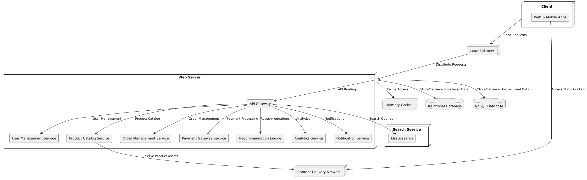

# Mamaearth High-Level Design (HLD)

This document outlines the high-level design architecture for the Mamaearth e-commerce platform, which is focused on selling personal care products. The architecture is designed to be scalable, secure, and user-friendly.

---

## **Architecture Overview**

The system is divided into multiple components to ensure modularity, scalability, and resilience. The major components are:

### 1. **Frontend**
- **Web Application**: For customers to browse, search, and purchase products.
- **Mobile Application**: Native mobile app for Android and iOS users.
- **Admin Panel**: For managing inventory, orders, promotions, and customer data.

### 2. **Backend Services**
- **User Management Service**:
  - Handles user authentication (OAuth, social login).
  - Manages user profiles and roles.
- **Product Catalog Service**:
  - Stores product details, categories, inventory, and pricing.
  - Supports promotions and discount features.
- **Order Management System (OMS)**:
  - Processes orders, tracks payments, and manages shipping.
  - Handles order cancellations and returns.
- **Payment Gateway Integration**:
  - Supports multiple payment methods: cards, UPI, wallets, PayPal.
  - Ensures secure transaction handling with PCI DSS compliance.
- **Recommendation Engine**:
  - Recommends products based on user preferences, history, and behavior.
- **Analytics Service**:
  - Tracks user activity, sales trends, inventory levels, and revenue.
- **Notification Service**:
  - Sends real-time notifications via email, SMS, and push.

### 3. **Database Layer**
- **Relational Database (RDBMS)**:  
  - For structured data like user accounts, orders, and transactions (e.g., MySQL/PostgreSQL).
- **NoSQL Database**:  
  - For unstructured data such as reviews, logs, and notifications (e.g., MongoDB).

### 4. **Caching Layer**
- Implements Redis or Memcached for caching frequently accessed data like:
  - Product details.
  - User sessions.
  - Search results.

### 5. **Search Service**
- **Elasticsearch** for efficient product searches with filters and auto-complete suggestions.

### 6. **Content Delivery Network (CDN)**
- Ensures fast delivery of static assets (e.g., images, stylesheets, scripts) with low latency.

### 7. **Microservices Architecture**
- Each service (e.g., User Management, Product Catalog, OMS) is independently deployable and scalable.

### 8. **DevOps and Deployment**
- **CI/CD Pipelines**: Automated build, test, and deployment workflows.
- **Monitoring**:
  - Prometheus and Grafana for performance monitoring and alerting.

### 9. **Cloud Infrastructure**
- Hosted on **AWS**, **Azure**, or **GCP** for high availability and scalability.
- Includes:
  - **Load Balancers** for distributing traffic.
  - **Auto-scaling Groups** for handling dynamic loads.
  - **Storage Buckets** for storing static files and backups.

### 10. **Security Measures**
- **HTTPS**: Ensures secure communication.
- **Web Application Firewall (WAF)**: Protects against threats like SQL injection and DDoS attacks.
- **Role-Based Access Control (RBAC)**: Secures access to sensitive services and data.

---

## **Data Flow**
1. **User Interaction**:
   - Users access the platform via Web or Mobile apps.
   - Admins use the Admin Panel for management.
2. **Service Communication**:
   - Microservices communicate internally through RESTful APIs or gRPC.
3. **Database Access**:
   - Structured and unstructured data are fetched or updated via respective services.
4. **Caching**:
   - Frequently accessed data is retrieved from the caching layer to reduce latency.
5. **External Integrations**:
   - Payment processing is handled by third-party gateways.
   - Static assets are served via a CDN.

---

## **Scalability and Resilience**
- **Horizontal Scaling**:
  - Microservices can be scaled independently based on demand.
- **Fault Tolerance**:
  - Redundant systems and auto-recovery mechanisms ensure uptime.

---

## **Future Enhancements**
- Integration with Machine Learning models for personalized recommendations.
- Advanced reporting and insights dashboards.
- Support for global markets with multi-currency and multi-language features.

---

## **Diagram**
Include a diagram of the architecture. 
(*Replace with the actual link to your architecture diagram file.*)

---

## **Contributors**
- **System Architect**: [Your Name]  
- **Frontend Developer**: [Contributor Name]  
- **Backend Developer**: [Contributor Name]  
- **DevOps Engineer**: [Contributor Name]  

---

## **License**
This project is licensed under the MIT License. See the [LICENSE](./LICENSE) file for details.
